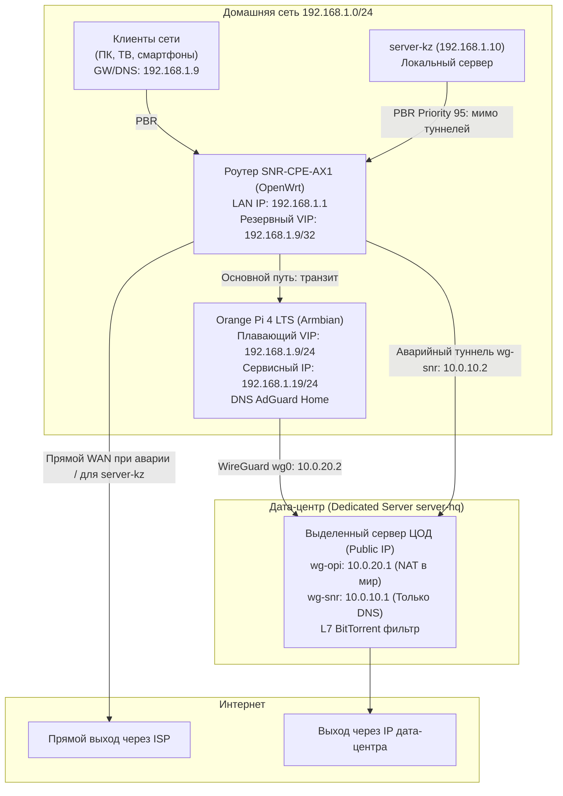

# Homelab SD-WAN Failover & PBR Routing

[](https://openwrt.org)
[](https://www.wireguard.com/)
[](#сетевая-топология)
[](#почему-система-была-разобрана-post-mortem)
[](LICENSE)

Проект домашней отказоустойчивой сетевой инфраструктуры с выносом крипто-нагрузки на одноплатный компьютер (**Orange Pi 4 LTS**), туннелированием в удаленный **выделенный сервер (дедик) в ЦОД**, динамической маршрутизацией (**Policy-Based Routing / PBR**), самодельным механизмом **VRRP/Failover** на базе Gratuitous ARP и L7-фильтрацией P2P-трафика в туннеле WireGuard.

> 📝 **Статья для Хабра:** подробный инженерный разбор, история эволюции от дублирования DNS к полному туннелированию, грабли и выводы описаны в файле [ARTICLE_HABR.md](ARTICLE_HABR.md).

---

## Содержание

- [История создания и эволюция](#история-создания-и-эволюция)
- [Сетевая топология](#сетевая-топология)
- [Таблица адресации](#таблица-адресации)
- [Ключевые инженерные решения](#ключевые-инженерные-решения)
  - [1. Разгрузка процессора роутера](#1-разгрузка-процессора-роутера)
  - [2. Двусторонний Failover и трюк с двумя IP](#2-двусторонний-failover-и-трюк-с-двумя-ip)
  - [3. Защита от петель маршрутизации (PBR Anti-Loop)](#3-защита-от-петель-маршрутизации-pbr-anti-loop)
  - [4. Изоляция локального сервера](#4-изоляция-локального-сервера)
  - [5. L7-фильтрация BitTorrent на сервере ЦОД](#5-l7-фильтрация-bittorrent-на-сервере-цод)
  - [6. Прозрачность IP клиентов в AdGuard Home](#6-прозрачность-ip-клиентов-в-adguard-home)
- [Структура репозитория](#структура-репозитория)
- [Как устроен Failover (Алгоритм)](#как-устроен-failover-алгоритм)
- [Развертывание и настройка](#развертывание-и-настройка)
- [Почему система была разобрана (Post-Mortem)](#почему-система-была-разобрана-post-mortem)
- [Как сделать по уму (Best Practices)](#как-сделать-по-уму-best-practices)

---

## История создания и эволюция

Архитектура родилась не сразу, а прошла через 4 этапа эволюции:

1. **Боль одного DNS и первое дублирование:** Дома работал локальный сервер `server-kz` (192.168.1.10) с AdGuard Home. При его перезагрузках или обслуживании весь дом оставался без интернета из-за падения DNS. Чтобы решить проблему, на удаленном **выделенном сервере (дедике) в ЦОД** был поднят второй AdGuard Home, а роутер соединен с ним резервным туннелем WireGuard. При отключении домашнего сервера роутер мгновенно заворачивал DNS в ЦОД — задержка чуть возрастала, но никто из домашних даже не замечал сбоя!
2. **Рождение идеи полного туннелирования:** Увидев, насколько бесшовно отрабатывает схема, появилась идея: а почему бы не завернуть вообще **весь трафик дома** в ЦОД (за исключением рабочего `server-kz`, которому нужен прямой казахстанский интернет)?
3. **Кремниевый тупик роутера:** Попытка поднять общий туннель на роутере SNR-CPE-AX1 уперлась в 100 Мбит/с (процессор захлебнулся в программных прерываниях sirq). Для крипто-разгрузки в сеть была добавлена Orange Pi 4 LTS на базе Rockchip RK3399.
4. **Отказоустойчивый кластер:** Разработка взаимного мониторинга между роутером и Orange Pi, чтобы при падении одноплатника или его туннеля интернет мгновенно возвращался на прямого провайдера, а DNS переключался в резервный туннель к дедику в ЦОД.

---

## Сетевая топология



---

## Таблица адресации

| Хост / Роль | Физический / LAN IP | Туннельный IP | Назначение |
|---|---|---|---|
| **Роутер (SNR-CPE-AX1)** | `192.168.1.1` | `10.0.10.2` (`wg-snr`) | L2/L3 коммутатор, PBR, аварийный DNS-клиент |
| **Orange Pi 4 LTS** | `192.168.1.9` (VIP)<br>`192.168.1.19` (Static) | `10.0.20.2` (`wg0`) | Основной крипто-шлюз и AdGuard Home DNS |
| **Домашний сервер (server-kz)** | `192.168.1.10` | — | Локальный рабочий сервер (всегда мимо ЦОД) |
| **Сервер ЦОД (server-hq)** | `203.0.113.186` (WAN) | `10.0.20.1` (`wg-opi`)<br>`10.0.10.1` (`wg-snr`) | Выделенный сервер (шлюз и резервный DNS) |

---

## Ключевые инженерные решения

### 1. Разгрузка процессора роутера
Процессор роутера SNR-CPE-AX1 не справлялся с шифрованием WireGuard (ChaCha20-Poly1305) на скоростях выше ~100 Мбит/с из-за шквала прерываний `ksoftirqd/sirq`. Вся крипто-нагрузка вынесена на Orange Pi 4 LTS (Rockchip RK3399), который обрабатывает трафик без видимой нагрузки на процессор.

### 2. Двусторонний Failover и трюк с двумя IP
Чтобы роутер мог перехватить виртуальный IP (`.9`), но при этом продолжал мониторить состояние «упавшей» Orange Pi, интерфейсу `eth0` на плате назначено **два IP-адреса**:
- `192.168.1.9` — мигрирующий **VIP**. При падении туннеля плата снимает этот IP с себя, и его забирает роутер.
- `192.168.1.19` — статический **сервисный IP**. Роутер шлет уникальные DNS-запросы вида `check-$(date +%s).google.com` на адрес `.19`, чтобы обойти кэши и точно убедиться, что резолвер на плате снова функционирует.

### 3. Защита от петель маршрутизации (PBR Anti-Loop)
При перенаправлении всей подсети `192.168.1.0/24` на шлюз Orange Pi пакеты самого WireGuard-туннеля до внешнего IP ЦОД рисковали попасть под это же правило.
В таблицы PBR роутера и Orange Pi внедрено правило исключения:
```bash
ip rule add to 203.0.113.186 lookup main priority 92
```

### 4. Изоляция локального сервера
Домашний сервер (`192.168.1.10`) принудительно исключен из туннелей как на уровне PBR роутера (`priority 95`), так и фаерволом Orange Pi:
```bash
iptables -I FORWARD 1 -s 192.168.1.10 -o wg0 -j DROP
```

### 5. L7-фильтрация BitTorrent на сервере ЦОД
Для защиты арендованного выделенного сервера от абуз и блокировок со стороны дата-центра на интерфейсе `wg-opi` включена глубокая инспекция первых 4 пакетов соединений:
```bash
iptables -I FORWARD 1 -i wg-opi -m connbytes --connbytes-dir original \
    --connbytes-mode packets --connbytes 1:4 \
    -m string --string "BitTorrent protocol" --algo bm --to 1500 -j DROP
iptables -I FORWARD 1 -i wg-opi -p tcp -m multiport --dports 6881:6889 -j DROP
```

### 6. Прозрачность IP клиентов в AdGuard Home
Обычно при выносе DNS на отдельный хост роутер проксирует запросы, из-за чего в логах AdGuard все запросы сливаются в один IP роутера (`192.168.1.1`). Для сохранения честной статистики и индивидуальной фильтрации реализованы два механизма:
1. **DHCP Option 6 в OpenWrt (`dhcp.uci`):** Клиентам сразу отдается IP AdGuard Home (`list dhcp_option '6,192.168.1.9'`). Устройства общаются с резолвером напрямую на уровне L2 со своих уникальных IP.
2. **EDNS Client Subnet (`dnsmasq.conf`):** При транзитных запросах через сам роутер директивы `add-mac` и `add-subnet=32,128` передают исходные MAC и IP клиента в AdGuard Home.

---

## Структура репозитория

```
├── ARTICLE_HABR.md              # Развернутая статья для Хабра с полным разбором
├── README.md                    # Документация проекта (вы здесь)
├── configs/
│   ├── router-snr/              # Конфигурации для роутера (OpenWrt)
│   │   ├── dns_failover.sh      # Скрипт проверки, перехвата VIP и управления PBR
│   │   ├── rc.local             # Исторический запуск скрипта в цикле
│   │   ├── dhcp.uci             # Настройки /etc/config/dhcp (раздача option 6)
│   │   └── dnsmasq.conf         # Дополнительные директивы dnsmasq
│   ├── orangepi/                # Конфигурации для Orange Pi 4 LTS (Armbian)
│   │   ├── tunnel_watchdog.sh   # Сторож туннеля ЦОД и локального DNS
│   │   └── wg0.conf             # WireGuard клиент с PBR таблицей 200
│   └── server-hq/               # Конфигурации для выделенного сервера ЦОД
│       ├── wg-opi.conf          # Основной шлюз для Orange Pi с анти-торрент защитой
│       └── wg-snr.conf          # Резервный DNS-туннель для роутера
└── .gitignore                   # Защита от утечки ключей и логов
```

---

## Как устроен Failover (Алгоритм)

```
[Штатный режим (Normal)]
1. Orange Pi держит VIP 192.168.1.9/24.
2. Watchdog проверяет: ping 10.0.20.1 (OK) + nc port 53 (OK).
3. Роутер держит маршрут: default via 192.168.1.9 table 100.
4. Трафик LAN -> Orange Pi -> WireGuard -> Дедик в ЦОД -> Интернет.

             │  Авария: падение туннеля / сбой DNS
             ▼
[Срабатывание Failover]
1. Watchdog на Orange Pi видит 2 сбоя подряд.
2. Orange Pi удаляет IP 192.168.1.9/24 с интерфейса eth0.
3. Роутер видит потерю пинга до 192.168.1.9:
   - Назначает себе: ip addr add 192.168.1.9/32 dev br-lan
   - Оповещает клиентов: arping -U -c 3 -I br-lan 192.168.1.9
   - Включает DNAT для DNS: порт 53 -> 10.0.10.1:53 (туннель wg-snr к дедику)
   - Сбрасывает PBR: ip route flush table 100
4. Клиенты выходят в интернет напрямую через провайдера, DNS идет через wg-snr.

             │  Восстановление: туннель и DNS ожили
             ▼
[Восстановление (Recovery)]
1. Orange Pi поднимает туннель, но .9 еще занят роутером.
2. Роутер каждые 10 секунд делает nslookup check-TIMESTAMP.google.com на 192.168.1.19.
3. Получив ответ, роутер удаляет .9/32, сбрасывает DNAT и восстанавливает PBR.
4. Orange Pi замечает освобождение IP через arping -D и вешает 192.168.1.9 обратно.
5. Система вернулась в штатный режим!
```

---

## Развертывание и настройка

> ⚠️ **Безопасность:** Перед развертыванием сгенерируйте собственные WireGuard-ключи (`wg genkey | tee private.key | wg pubkey > public.key`) и замените плейсхолдеры `<...KEY>` и IP-адреса `203.0.113.186` на реальные.

1. **Сервер ЦОД (server-hq):**
   - Скопируйте `configs/server-hq/wg-opi.conf` и `wg-snr.conf` в `/etc/wireguard/`.
   - Поднимите интерфейсы: `wg-quick up wg-opi && wg-quick up wg-snr`.
   - Включите автозапуск: `systemctl enable wg-quick@wg-opi wg-quick@wg-snr`.
2. **Orange Pi:**
   - Настройте статический сервисный IP `192.168.1.19/24` на интерфейсе `eth0`.
   - Скопируйте `configs/orangepi/wg0.conf` в `/etc/wireguard/`.
   - Разместите `configs/orangepi/tunnel_watchdog.sh` в `/usr/bin/` и сделайте исполняемым (`chmod +x`).
   - Настройте запуск watchdog через crontab или systemd timer (каждые 5-10 секунд).
3. **Роутер (OpenWrt):**
   - Настройте интерфейс `wg-snr` (клиент WireGuard до `10.0.10.1`).
   - Скопируйте `configs/router-snr/dns_failover.sh` в `/usr/bin/` (`chmod +x`).
   - Добавьте вызов скрипта в цикле в `/etc/rc.local` (как в `configs/router-snr/rc.local`).

---

## Почему система была разобрана (Post-Mortem)

Хотя инженерная цель была полностью достигнута и система надежно переключала трафик, в реальной повседневной эксплуатации проявились существенные минусы:

1. **Отсутствие блокировок:** В Казахстане нет государственных блокировок ресурсов, поэтому постоянное пропускание трафика через европейский дедик не давало практической пользы.
2. **Проблемы Datacenter ASN:** Внешний IP дата-центра вызывал постоянные проверки Cloudflare Turnstile/Captcha, блокировки со стороны банковских приложений и отказ работы локальных видеосервисов и доставок.
3. **Капризный ARP-кэш клиентов:** «Глупые» устройства (Smart TV, IoT) игнорировали Gratuitous ARP и зависали на несколько минут во время переключения.
4. **Усложнение обслуживания:** Поддержка распределенного кластера из трех узлов оказалась избыточной по сравнению с простой и стабильной схемой «один надежный SBC в локалке».

---

## Как сделать по уму (Best Practices)

Для тех, кто хочет реализовать подобную архитектуру в продакшене:

- **Демонизация через procd вместо rc.local:** В OpenWrt фоновые задачи надежнее запускать не через бесконечный цикл в `/etc/rc.local`, а через системный сервис `/etc/init.d/...` под управлением `procd` с параметром `respawn` (автоперезапуск при сбое).
- **VRRP через Keepalived:** Вместо связки скриптов `tunnel_watchdog.sh` + `dns_failover.sh` используйте демон `keepalived` с трекингом состояния туннеля (`vrrp_script`). Это даст сходимость сети менее чем за 1 секунду без конфликтов IP.
- **DNS-проксирование вместо угона IP:** Клиентам сети по DHCP всегда отдавайте адрес роутера (`192.168.1.1`). В `dnsmasq` роутера настройте опрос апстримов: приоритетный `192.168.1.19` (Orange Pi), резервный `10.0.10.1` (дедик в ЦОД). Роутер сам прозрачно переключит DNS без манипуляций с ARP.
- **Очистка Conntrack:** При переключении PBR таблиц обязательно выполняйте сброс таблицы трансляций состояний ядра (`conntrack -D -s 192.168.1.0/24`), чтобы старые сокеты не зависали в мертвом канале.

---

## Лицензия

Материалы и скрипты распространяются под лицензией MIT. Используйте для экспериментов, обучения и создания собственных отказоустойчивых хоумлабов!
